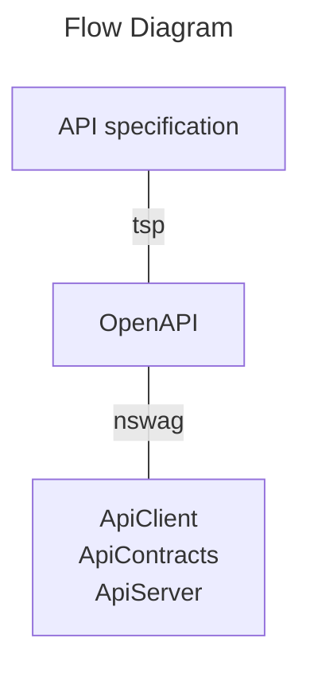
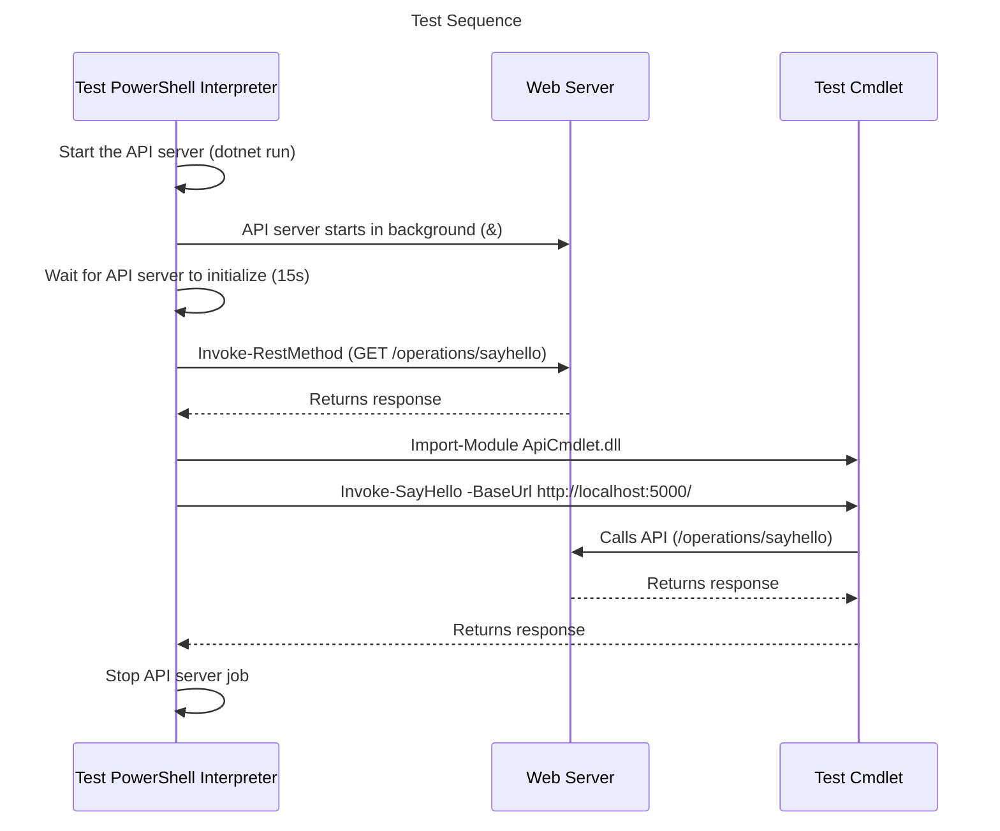

# API-E2E

## About

This project contains an example of API development loop that, in my humble opinion, works well for projects where multiple APIs have to be defined and maintained.

This end to end example demonstrates definition of an HTTP API with TypeSpec, production of OpenAPI specification followed by generating client and server size code, exposing resulting client SDK as PowerShell cmdlet for convenient scripting of API testing scenarios. 

The flow:
- API surface is specified using TypeSpec.
- TypeSpec produces OpenAPI specification.
- OpenAPI specification is used to generate elements of C# SDK for the API Surface: Contracts, Client.
- OpenAPI specification is also used to generate an API Controller for ASP.NET Core WebAPI.
- All resulting binaries are tested on CI build, shifting as much left as possible:
    - Test starts Web API server using the built server binary
    - Test executes sample commands:
        - using direct REST API calls
        - using the generated client SDK wrapped in a PowerShell cmdlet for scripting convenience

## Preparing developer environment

### Install .NET

https://learn.microsoft.com/en-us/dotnet/core/install/

### Install TypeSpec

https://microsoft.github.io/typespec/introduction/installation

### NSWag via NPM

https://www.npmjs.com/package/nswag

# Running tests

Instructions:

    dotnet build ./ApiCmdlet/
    pwsh -c ./ApiTest/start-use-stop.ps1
